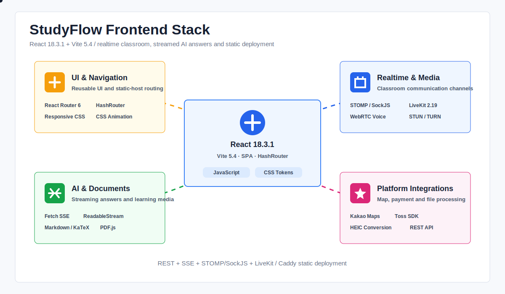
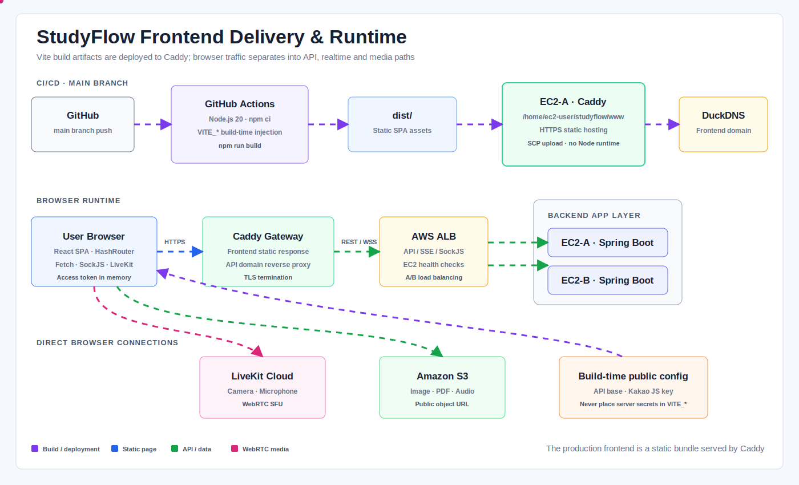

# StudyFlow Frontend

<div align="center">
  <strong>실시간 수업부터 질문과 복습까지 연결하는 온라인 과외 학습 플랫폼</strong>
  <p>화상 강의실, 서버 동기화 화이트보드, AI 질문, 채팅, 오답노트와 결제를 하나의 사용자 경험으로 제공합니다.</p>
</div>

<p align="center">
  
</p>

<p align="center">
  <a href="./docs/assets/frontend-stack-animated.svg">애니메이션 기술 스택 크게 보기</a>
</p>

---

## 프로젝트 소개

StudyFlow 프론트엔드는 학생과 선생님이 수업을 찾고, 실시간 강의실에서 함께 학습하며, 질문과 복습까지 이어갈 수 있도록 만든 React SPA입니다.

프론트엔드는 다음 역할을 담당합니다.

- 사용자 역할과 인증 상태에 따른 화면 및 라우팅
- 수업·선생님 검색, 수강 신청과 승인 UI
- LiveKit 화상·음성·화면공유
- WebSocket/STOMP 기반 채팅과 강의실 도구 동기화
- 화이트보드, PDF, 이미지와 오디오 학습 도구
- AI 답변 SSE 스트리밍과 Markdown·수학 수식 렌더링
- 질문게시판, 오답노트와 복습 추천
- 마일리지 충전, Toss Payments 결제와 구독권
- 관리자 대시보드와 선생님 인증 처리

프로젝트 기간: **2026년 5월 19일 ~ 2026년 6월 26일**

---

## 핵심 프론트엔드 설계

| 영역 | 설계 |
| --- | --- |
| 정적 배포 | `HashRouter`와 Vite `base: './'`을 사용해 별도 서버 라우팅 없이 Caddy에서 SPA 제공 |
| API 주소 | 환경별 `VITE_API_BASE`를 사용하고 LAN 개발 환경에서는 현재 호스트의 `:8080`으로 자동 해석 |
| 인증 | Access Token은 메모리에만 저장하고 Refresh Token은 백엔드 HttpOnly 쿠키로 관리 |
| 토큰 재발급 | `authFetch`가 401 응답을 받으면 single-flight 방식으로 한 번만 재발급하고 요청 재시도 |
| AI 스트리밍 | POST와 Authorization이 필요해 `EventSource` 대신 Fetch `ReadableStream`으로 SSE 직접 파싱 |
| 강의실 미디어 | LiveKit이 카메라·마이크·FHD 화면공유를 담당하고 실제 송출 권한은 백엔드 토큰으로 결정 |
| 강의실 도구 | STOMP/SockJS가 화이트보드·PDF 페이지·오디오·채팅·퀴즈 이벤트를 동기화 |
| 보이스톡 | WebRTC `RTCPeerConnection`과 STOMP 시그널링을 사용하며 STUN/TURN은 환경변수로 구성 |
| 문서와 수식 | PDF.js, React Markdown, KaTeX를 사용해 PDF와 AI 수학 답변 표시 |

---

## 기술 스택

| 구분 | 기술 |
| --- | --- |
| Core | React 18.3.1, React DOM |
| Build | Vite 5.4, `@vitejs/plugin-react` |
| Routing | React Router DOM 6.27, HashRouter |
| Styling | CSS, CSS Custom Properties, CSS Animation |
| API | Fetch API, ReadableStream, AbortController |
| Realtime | STOMP.js 7.3, SockJS 1.6 |
| Media | LiveKit Client 2.19, WebRTC |
| AI Rendering | React Markdown, remark-gfm, remark-math, rehype-katex, KaTeX |
| Documents | PDF.js 6.0 |
| Image | heic2any |
| Map | Kakao Maps JavaScript SDK |
| Payment | Toss Payments SDK 2.7 |
| Deployment | GitHub Actions, AWS EC2, Caddy, DuckDNS |

---

## 주요 기능

### 인증과 사용자

- 이메일 회원가입·로그인과 이메일 인증
- Kakao, Google, Naver OAuth2 로그인
- 새로고침 시 Refresh Token 쿠키를 이용한 인증 복구
- 401 응답 시 Access Token 재발급과 원래 요청 재시도
- 비밀번호 재설정, 로그인 기록과 회원 탈퇴

### 수업과 선생님

- 과목·수업 방식·지역·가격·인원 필터
- 최신순·가격순·거리순 정렬
- 선생님 검색과 학생·선생님 상세 페이지
- 수업 등록, 수정, 상세와 수업별 대시보드
- 수강 신청, 선생님 승인, 수강 포기와 마일리지 부족 처리
- Kakao Maps 기반 대면 수업 위치 지정

### 실시간 강의실

- LiveKit 카메라·마이크·화면공유
- 참가자 영상 타일, 활성 발화자와 전체화면
- 서버 권위 화이트보드와 `seq/snapshot/resync`
- 펜·형광펜·지우개·도형·텍스트·레이어·확대·축소·손 도구
- 이미지와 PDF 업로드, PDF·화이트보드 페이지 분리 이동
- 오디오 재생·정지·탐색·배속·AB 반복 동기화
- 강의실 채팅, 반응, 참가자 판서 권한과 제한시간 퀴즈
- 비수강생 강의실 미리보기

### 채팅과 보이스톡

- 모든 일반 페이지에서 열 수 있는 전역 채팅 위젯
- 학생·선생님 1:1 채팅과 읽음 처리
- 수업별 단체 채팅방 생성과 학생 초대·내보내기
- 여러 이미지 첨부와 드래그 앤 드롭
- WebRTC 음성 통화와 STOMP 기반 SDP/ICE 시그널링

### AI 질문과 학습

- 과목별 AI 질문과 대화 목록
- 답변 토큰 SSE 스트리밍과 생성 취소
- 이미지 첨부 및 AI 생성 이미지 표시
- Markdown, GFM, LaTeX 수식 렌더링
- 질문게시판 작성·수정·검색·답변·채택
- 질문게시판과 AI 답변을 오답노트로 이동
- 오답노트 작성·수정·삭제·과목별 탐색
- 복습 추천, 답안 보기와 복습 결과 기록

### 결제와 관리

- Toss Payments 결제창을 이용한 마일리지 충전
- AI 질문권과 Live 강의 구독권 구매
- 학생 마일리지와 선생님 수익 내역
- 관리자 회원 통계, 선생님 인증 승인·거절과 거래 내역

---

## 팀 역할 분담

아래 역할은 프론트엔드와 백엔드를 합친 프로젝트 전체 기준입니다.

| 팀원 | 담당 기능 |
| --- | --- |
| **이재섭 (congsoony)** | 팀장·발표, 실시간 강의실, 서버 권위 화이트보드, PDF·오디오 동기화, Redis 멀티 인스턴스 대응, 채팅·보이스톡, 질문게시판, AI 질문/SSE, 오답노트·복습 추천, 마일리지 충전·결제·수익 내역, 부하테스트와 AWS 운영 검증 |
| **김현우 (gusdnzla26-art)** | 수업 상세 페이지, 학생 수강 포기, 수업 수정 제한, 화상수업 진행 시간 기반 내공 지급, 마이페이지 탭과 라우팅 개선 |
| **이준영 (leejy1019)** | 수업·선생님 찾기, 찾기 페이지 노출 토글, 학생·선생님 상세, 수업 등록·수업별 페이지, 알림, 강의실 미리보기, 선생님 마이페이지 프로필·인증 |
| **전우현 (jwh039)** | Spring Security, JWT 파싱과 역할별 인증·인가, 이메일 인증, 회원가입·로그인·소셜 로그인·로그아웃·회원 탈퇴, Access Token 재발급과 RTR, 비밀번호 재설정, 로그인 기록, 선생님 인증 승인·거절과 회원 통계 |

---

## 프로젝트 구조

```text
src/
├── main.jsx
├── App.jsx                     # HashRouter와 전체 페이지 라우팅
├── api/
│   ├── config.js              # API 주소와 LAN 환경 해석
│   ├── authFetch.js           # Access Token 첨부, 401 재발급·재시도
│   ├── aiApi.js               # POST SSE 파싱
│   ├── chatSocket.js          # STOMP/SockJS 연결과 구독
│   ├── voiceConfig.js         # STUN/TURN 구성
│   └── *Api.js                # 도메인별 REST API
├── auth/
│   ├── tokenStore.js          # 메모리 Access Token 저장소
│   ├── authApi.js             # Refresh Token 재발급
│   └── AuthBootstrap.jsx      # 앱 시작 시 인증 복구
├── components/
│   ├── layout/                # Navbar와 공통 배경
│   ├── chat/                  # 전역 채팅, 수업톡, 보이스톡
│   ├── notifications/         # 알림과 브라우저 알림
│   └── ui/                    # 공통 UI
├── pages/
│   ├── home/                  # 홈과 강의실 미리보기
│   ├── auth/                  # 로그인·OAuth2·비밀번호 재설정
│   ├── search/                # 수업 검색과 필터
│   ├── teachers/              # 선생님 검색과 상세
│   ├── courses/               # 수업 등록·수정·상세·대시보드
│   ├── classroom/             # LiveKit 강의실과 화이트보드
│   ├── ai/                    # AI 질문과 Markdown/KaTeX
│   ├── qna/                   # 질문게시판
│   ├── mypage/                # 학생·선생님·오답노트
│   ├── payment/               # 마일리지와 구독권
│   └── admin/                 # 관리자 대시보드
├── payment/                   # Toss Payments SDK 연동
├── styles/                    # 페이지별 CSS
└── utils/                     # 공통 유틸
```

---

## 로컬 실행 방법

### 요구사항

- Node.js 20 LTS 권장
- npm
- 실행 중인 StudyFlow 백엔드: 기본 `http://localhost:8080`

### 1. 저장소 설치

```powershell
git clone <FRONTEND_REPOSITORY_URL>
cd <FRONTEND_DIRECTORY>
npm ci
```

`package-lock.json`을 기준으로 동일한 버전을 설치하기 위해 `npm install`보다 `npm ci`를 권장합니다.

### 2. 로컬 환경변수 작성

PowerShell:

```powershell
Copy-Item .env.local.example .env.local
```

macOS/Linux:

```bash
cp .env.local.example .env.local
```

`.env.local` 예시:

```dotenv
VITE_API_BASE=http://localhost:8080
VITE_KAKAO_MAP_KEY=your-kakao-javascript-key

# 선택: 보이스톡 STUN/TURN
# JSON 배열 또는 콤마 구분 URL을 지원합니다.
VITE_VOICE_ICE_SERVERS=[{"urls":"stun:stun.l.google.com:19302"}]
```

`VITE_KAKAO_MAP_KEY`가 없어도 지도를 제외한 기능은 실행할 수 있습니다.

### 3. 개발 서버 실행

```powershell
npm run dev
```

- 로컬 주소: `http://localhost:5173`
- Vite가 브라우저를 자동으로 엽니다.
- `host: true` 설정으로 같은 LAN의 다른 기기에서도 접근할 수 있습니다.

### 4. LAN 기기에서 테스트

```text
http://<개발 PC의 사설 IP>:5173
```

프론트를 LAN IP로 열면 API 주소도 기본적으로 같은 호스트의 `:8080`으로 맞춰집니다. 백엔드 CORS에는 해당 프론트 Origin을 추가해야 합니다.

카메라와 마이크의 `getUserMedia()`는 보안 컨텍스트가 필요합니다. `localhost`는 HTTP에서도 허용되지만, 다른 기기의 `http://192.168.x.x:5173`에서는 브라우저가 차단할 수 있으므로 실제 기기 테스트는 HTTPS 환경을 권장합니다.

### 5. 프로덕션 빌드

PowerShell:

```powershell
$env:VITE_API_BASE="https://your-api-domain.example.com"
$env:VITE_KAKAO_MAP_KEY="your-kakao-javascript-key"
npm run build
npm run preview
```

macOS/Linux:

```bash
VITE_API_BASE=https://your-api-domain.example.com \
VITE_KAKAO_MAP_KEY=your-kakao-javascript-key \
npm run build
npm run preview
```

빌드 결과는 `dist/`에 생성됩니다.

### npm 명령

| 명령 | 설명 |
| --- | --- |
| `npm run dev` | Vite 개발 서버 실행 |
| `npm run build` | 프로덕션 정적 파일 생성 |
| `npm run preview` | `dist/` 로컬 미리보기 |

현재 별도의 `test`와 `lint` 스크립트는 등록되어 있지 않으므로 PR 전 최소 검증은 `npm run build`입니다.

---

## 환경변수

Vite는 `VITE_` 접두사가 붙은 값을 빌드 시점에 JavaScript 번들에 삽입합니다.

| 변수 | 필수 여부 | 설명 |
| --- | :---: | --- |
| `VITE_API_BASE` | 운영 필수 | 백엔드 API Origin. 예: `https://studyflow-mytutor-api.duckdns.org` |
| `VITE_KAKAO_MAP_KEY` | 지도 사용 시 | Kakao Maps JavaScript Key |
| `VITE_VOICE_ICE_SERVERS` | 선택 | WebRTC 보이스톡용 STUN/TURN 목록 |

`VITE_VOICE_ICE_SERVERS` 지원 형식:

```dotenv
# JSON
VITE_VOICE_ICE_SERVERS=[{"urls":"turn:turn.example.com:3478","username":"user","credential":"password"}]

# 콤마 구분
VITE_VOICE_ICE_SERVERS=stun:stun1.example.com:3478,stun:stun2.example.com:3478
```

설정하지 않으면 기본값 `stun:stun.l.google.com:19302`를 사용합니다. 실제 운영에서는 대칭 NAT와 방화벽 환경을 위해 TURN 서버를 함께 사용하는 것이 안전합니다.

---

## 프론트엔드 Secret 관리

### `VITE_*`는 비밀값이 아닙니다

`VITE_*` 값은 최종 `dist/` JavaScript에 포함되므로 브라우저 개발자 도구에서 확인할 수 있습니다. GitHub Actions Secrets에 저장하더라도 빌드 로그에서만 가려질 뿐 최종 번들에서는 공개됩니다.

프론트에 넣어도 되는 값:

- 백엔드 공개 URL
- 도메인 제한을 설정한 Kakao JavaScript Key
- 공개 가능한 STUN URL
- Toss Payments Client Key와 같은 공개용 키

프론트에 절대 넣으면 안 되는 값:

- JWT Secret
- OpenAI API Key
- LiveKit API Secret
- Toss Payments Secret Key
- OAuth Client Secret
- AWS Access Key와 Secret Key
- DB·Redis 비밀번호

### 프로젝트의 비밀키 처리

| 항목 | 처리 방식 |
| --- | --- |
| JWT | Access Token만 메모리에 저장, JWT 서명 Secret은 백엔드에만 존재 |
| Refresh Token | 백엔드가 HttpOnly 쿠키로 관리 |
| LiveKit | 프론트가 백엔드에서 단기 입장 토큰을 발급받아 연결 |
| Toss Payments | Client Key는 백엔드 API에서 받고 Secret Key와 결제 승인은 백엔드에서 처리 |
| OpenAI | 프론트는 StudyFlow API만 호출하며 OpenAI Key는 백엔드에만 존재 |
| Kakao Maps | JavaScript Key는 공개 키이므로 Kakao 콘솔에서 허용 도메인 제한 |
| TURN Credential | 정적 `VITE_*` 값은 노출되므로 운영에서는 단기 TURN Credential 발급 구조 권장 |

로컬 전용 파일은 Git에 커밋하지 않습니다.

```text
.env.local
.env.production
.env.*.local
```

확인:

```powershell
git check-ignore .env.local
git check-ignore .env.production
```

---

## 배포 환경과 CI/CD

<p align="center">
  
</p>

<p align="center">
  <a href="./docs/assets/frontend-deployment-animated.svg">애니메이션 배포 구조 크게 보기</a>
</p>

### 자동 배포 흐름

```text
main 브랜치 push
 → GitHub Actions
 → Node.js 20 + npm ci
 → VITE_API_BASE와 VITE_KAKAO_MAP_KEY 주입
 → npm run build
 → dist/* 생성
 → SCP로 EC2-A /home/ec2-user/studyflow/www 업로드
 → Caddy가 HTTPS 정적 파일 제공
```

`develop`은 개발 통합 브랜치이며 자동 배포하지 않습니다.

### GitHub Actions Secrets

| 이름 | 용도 |
| --- | --- |
| `EC2_HOST` | EC2-A의 배포용 주소 |
| `EC2_USER` | SSH 사용자, 현재 `ec2-user` |
| `EC2_SSH_KEY` | EC2 접속용 PEM Private Key |
| `VITE_API_BASE` | 운영 백엔드 API Origin |
| `VITE_KAKAO_MAP_KEY` | Kakao Maps JavaScript Key |

`VITE_VOICE_ICE_SERVERS`를 운영 빌드에 사용하려면 GitHub Actions Secret 등록뿐 아니라 `deploy-fe.yml`의 Build 단계 `env`에도 명시적으로 추가해야 합니다.

### 브라우저 런타임 통신

| 기능 | 연결 경로 |
| --- | --- |
| React 정적 파일 | Browser → DuckDNS → EIP/Caddy → `www` |
| REST·SSE·SockJS | Browser → API 도메인/Caddy → ALB → Spring Boot EC2-A/B |
| 화상·음성·화면공유 | Browser → LiveKit Cloud |
| 이미지·PDF·오디오 | Browser → S3 공개 URL |

프론트 운영 서버에는 Node.js 애플리케이션이 상시 실행되지 않습니다. Vite가 만든 정적 파일을 Caddy가 제공하는 구조입니다.

---

## 주요 라우트

HashRouter를 사용하므로 실제 브라우저 주소는 `/#/courses` 형태입니다.

| 경로 | 화면 |
| --- | --- |
| `/` | 홈 |
| `/courses` | 수업 찾기 |
| `/courses/new` | 수업 등록 |
| `/courses/:id` | 수업 상세 |
| `/courses/:id/edit` | 수업 수정 |
| `/courses/:id/dashboard` | 수업 대시보드 |
| `/teachers` | 선생님 찾기 |
| `/teachers/:id` | 선생님 상세 |
| `/classroom/:courseId` | 실시간 강의실 |
| `/ai` | AI 질문 |
| `/qna` | 질문게시판 |
| `/qna/write` | 질문 작성 |
| `/qna/:questionId` | 질문 상세 |
| `/mypage` | 학생·선생님 마이페이지 |
| `/payment/charge` | 마일리지 충전 |
| `/payment/subscriptions` | 구독권 구매 |
| `/payment/success` | 결제 성공 처리 |
| `/payment/fail` | 결제 실패 처리 |
| `/admin` | 관리자 |
| `/login` | 로그인·회원가입 |
| `/password-reset` | 비밀번호 재설정 요청 |
| `/reset-password` | 비밀번호 변경 |

---

## 관련 문서

- 프론트 배포 워크플로우: [`.github/workflows/deploy-fe.yml`](./.github/workflows/deploy-fe.yml)
- 로컬 환경변수 예시: [`.env.local.example`](./.env.local.example)
- 운영 환경변수 예시: [`.env.production.example`](./.env.production.example)

---

## License

본 프로젝트는 AIBE5 데브코스 최종 프로젝트로 제작되었습니다.